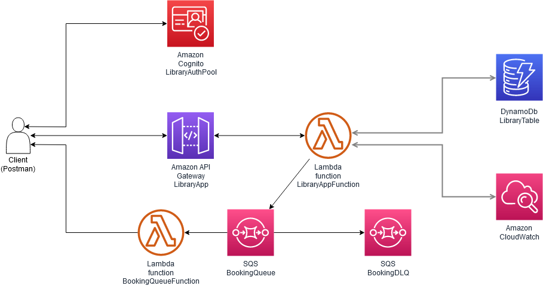
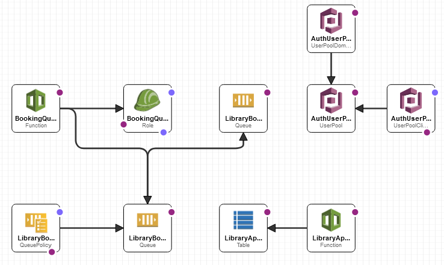
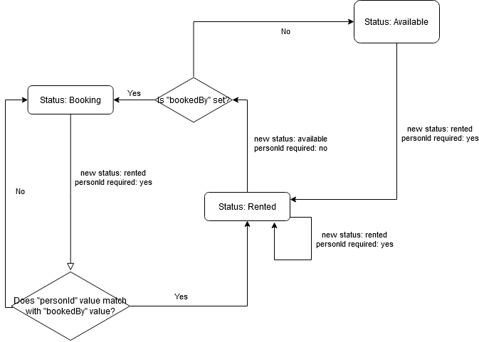

# **LibraryApp**

This application is backend API integrated library system allowing to store, manage and rent books to patrons in database. Project was created using Java 8 and its functioning is based on serverless architecture using Amazon Web Services (AWS).
<br/><br/>

# **Installation**

## **Requirements**
Application was created using following tools:
- IntelliJ IDEA 2022.2.4 Community Edition
- AWS Toolkit Plugin ver. 1.53-222
- Account in AWS website
- Docker 4.16.0
- SAM CLI 1.65.0
- Maven integrated into IntelliJ IDE

## **Environment set up**

1. Run IntelliJ IDE and from main menu select File > Settings > Plugins > Marketplace and search for AWS Toolkit plugin. 
2. After installation, restart IDE and go to View > Tool Windows > AWS Explorer.
3. Create credential files by clicking drop down menu in AWS Explorer tab and after generating access key id with secret access key (which can be created through steps listed below), fill blank fields according to file instructions.
    - Log in to AWS account on website and select *"Security credentials"* from profile menu in top right corner
    - Scroll down to *"Access Keys"* and select *"Create access key"*
    - Confirm root access key creation and write down *"Access key"* and *"Secret access key"*
4. Select created profile and desired server from dropdown menus in AWS Explorer tab.
5. Open project in IntelliJ by File > Open and selecting project directory with all files. After that, project is ready to edit source code and installation process.

## **AWS deploy**
To deploy application on AWS go through following steps:
1. Run Docker.
2. Right click *"template.yaml"* in IntelliJ Project Tool Window and select option *"Sync Serverless Application"*.
3. In dialog box fill *"Create stack"* field and create new bucket. Before confirming settings select all checkboxes: *IAM*, *Named IAM*, *Auto Expand*, *Build function inside a container*.
4. After building application find and write down endpoint URL in output logs inside *"Run"* tab. Application should now be available, although extra steps are needed to set up authorization.

## **AWS Cognito user**
In order to send requests to endpoint URL, it is essential to create user and receive access token added to every request. Log in to your AWS account and follow through steps:
1. Go to Cognito service and select *"Manage User Pools"*.
2. Select *"Library Auth Pool"* and go to *"Users and groups"* tab.
3. Press *"Create user"* and fill fields: *"Username"*, *"Temporary Password"*, *"Email"*. Make sure that *"Mark email as verified?"* is checked and confirm creation.
<br/><br/>


# **Architecture**
Application is created through AWS CloudFormation based on *template.yaml* file structure. 



AWS CloudFormation Designer template:<br/>



<br/><br/>
# **Functionality**

## Endpoints

Application runs on port 443 and following endpoints can be queried with parameters:

### 1. Books:

```
- GET /Prod/libraryApp?type=book

  Returns book's title, category and status from database based on parameter:
  - id - returns object with matching id
  - title - returns array of objects with matching title
  - category - returns array of objects with matching category
  - months - returns up to 5 books with most rents in last X months (X is 
    parameter value)
```
```
- POST /Prod/libraryApp?type=book
  Creates new object in database and returns its id. Required parameters:
  - title
  - category
```
```
- DELETE /Prod/libraryApp?type=book
  Removes book(s) from database based on parameter:
  - id - removes object with matching id
  - title - removes all objects with matching title and returns id of
    objects that could not be removed
```
```
- PUT /Prod/libraryApp?type=book
  Changes book's basic data e.g. title, or changes its availability status.
  
  Administrative request parameters (optional and null parameters will be ignored):
  - id (required)
  - newTitle (optional)
  - newCategory (optional)

  Status request parameters:
  - id (required)
  - status (required)
  - personId
```

### 2. Person:
```
- GET /Prod/libraryApp?type=person
  Returns all person type objects if no extra parameters are given. Additional parameters:
  - name - returns array of objects ids with matching name
```
```
- POST /Prod/libraryApp?type=person
  Creates new person in database and returns its id. Required parameters:
  - name
  - secondName
  - lastName
  - email
```
```
- DELETE /Prod/libraryApp?type=person
  Removes person from database and returns its id. Selectable parameters:
  - id (required)
```

### 3. History /Prod/libraryApp?type=history
```
- GET
  Returns history of person or book. Selectable parameters:
  - bookId - returns renting history of book
  - personId - returns full person data and history of personal rentings
```

## Services
Application logic, which is accessed by previously described endpoints, is contained in following classes and methods:
1. AddBookServiceImplementation
    - addBook - creates new book record in database
2. AddPersonServiceImplementation
    - addPerson - creates new person record in database
3. DeleteBookServiceImplementation
    - deleteBook - removes single book record based on *id* parameter
    - deleteBooks - removes multiple book records that match *title* parameter
4. DeletePersonServiceImplementation
    - deletePerson - removes single person record based on *id* parameter
5. GetBookServiceImplementation
    - getBook - returns single book record based on *id* parameter
    - getBooksByTitle - returns multiple book records that match *title* parameter
    - getBooksByCategory - returns multiple book records that match *category* parameter
    - getBooksByTrending - returns up to 5 book records that have most history type records      created in past x months (where x is *months* parameter)
6. GetHistoryServiceImplementation
    - getBookHistory - returns all history type records that are associated with book of given 
      *bookId* parameter
    - getPersonHistory - returns full user data and its history type records (renting history) based on given *personId* parameter
7. GetPersonServiceImplementation
    - getAllPeople - returns all person type records from database
    - getPersonById - returns person type record based on given *personId* parameter. Used in *getPersonHistory* method only (no endpoint)
    - getPersonByName - returns all person type records that match given *name* parameter
8. SendMessageServiceImplementation
    - sendMessage - method triggered by queue named *BookingQueue*, that forwards messages to specified server
9. UpdateBookServiceImplementation
    - updateBook - updates book's title and category to new values from *newTitle* and *newCategory*
    - updateBookStatus - updates book's status based on current and new status.

## Book status
Book record can have following statuses:
  - available - book is available to everyone
  - rented - book is unavailable
  - booking - book is available to person that has matching id with *bookedBy* field
  - removed - no operations can be made except finding by id

Additional information concerning status changes:
1. Books can be removed only when "available"
2. *rentedBy*, *rentPeriod*, *rentDate*, *bookedBy* fields are set while changing status to "rented"
3. *bookingEndDate* field is set when changing status to "available"
4. *removalDate* field is set when changing status to "removed"
5. All created dates take current time from "Europe/Warsaw" timezone

Simple flowchart presenting possible status changes and parameter requirements
<br/>

<br/><br/>
# **Tests**

Smoke tests were created in Postman as a mean to assert consistency of application's basic functionality. They are to be imported from file found in [documentation directory](/documentation/tests/libraryAppTests.postman_collection.json).
